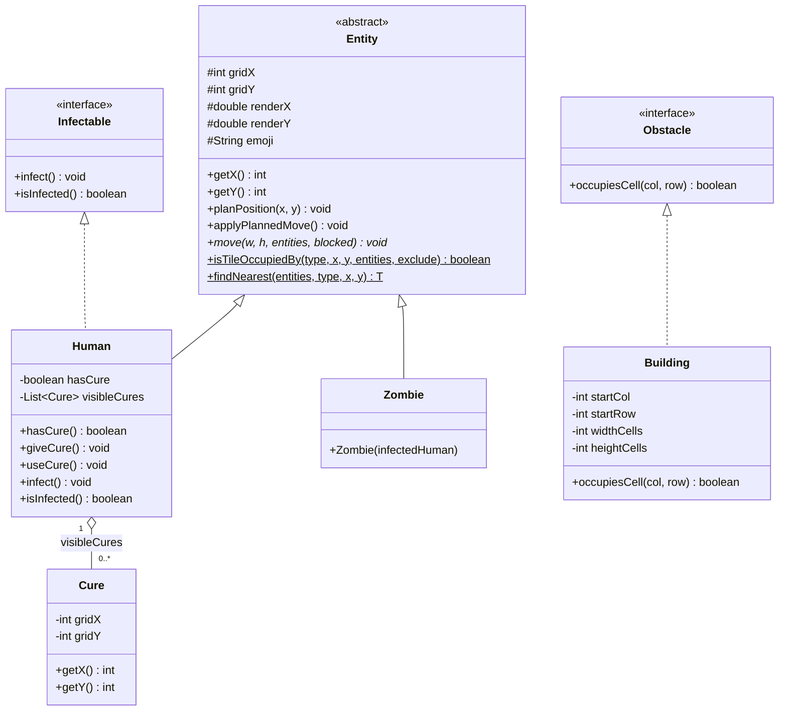
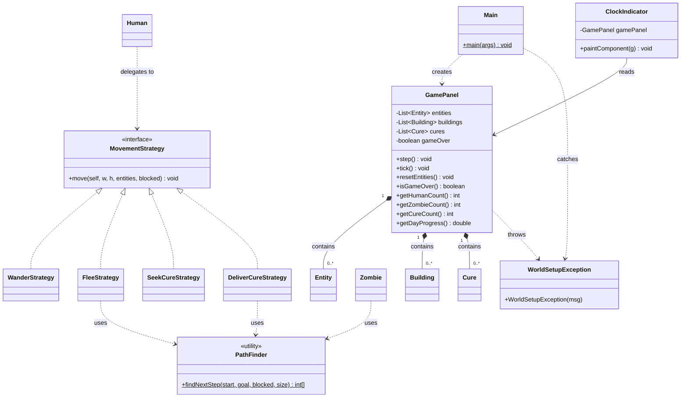

```mermaid
classDiagram
    direction TB

    class Entity {
        <<abstract>>
        #int gridX
        #int gridY
        #double renderX
        #double renderY
        #String emoji
        +getX() int
        +getY() int
        +planPosition(x, y) void
        +applyPlannedMove() void
        +move(w, h, entities, blocked)* void
        +isTileOccupiedBy(type, x, y, entities, exclude)$ boolean
        +findNearest(entities, type, x, y)$ T
    }

    class Human {
        -boolean hasCure
        -List~Cure~ visibleCures
        +hasCure() boolean
        +giveCure() void
        +useCure() void
        +infect() void
        +isInfected() boolean
    }

    class Zombie {
        +Zombie(infectedHuman)
    }

    class Cure {
        -int gridX
        -int gridY
        +getX() int
        +getY() int
    }

    class Building {
        -int startCol
        -int startRow
        -int widthCells
        -int heightCells
        +occupiesCell(col, row) boolean
    }

    class Infectable {
        <<interface>>
        +infect() void
        +isInfected() boolean
    }

    class Obstacle {
        <<interface>>
        +occupiesCell(col, row) boolean
    }

    Entity <|-- Human
    Entity <|-- Zombie
    Infectable <|.. Human
    Obstacle <|.. Building
    Human "1" o-- "0..*" Cure : visibleCures
```

```mermaid
classDiagram
    direction TB

    class GamePanel {
        -List~Entity~ entities
        -List~Building~ buildings
        -List~Cure~ cures
        -boolean gameOver
        +step() void
        +tick() void
        +resetEntities() void
        +isGameOver() boolean
        +getHumanCount() int
        +getZombieCount() int
        +getCureCount() int
        +getDayProgress() double
    }

    class MovementStrategy {
        <<interface>>
        +move(self, w, h, entities, blocked) void
    }

    class WanderStrategy
    class FleeStrategy
    class SeekCureStrategy
    class DeliverCureStrategy

    class PathFinder {
        <<utility>>
        +findNextStep(start, goal, blocked, size)$ int[]
    }

    class Main {
        +main(args)$ void
    }

    class ClockIndicator {
        -GamePanel gamePanel
        +paintComponent(g) void
    }

    class WorldSetupException {
        +WorldSetupException(msg)
    }

    MovementStrategy <|.. WanderStrategy
    MovementStrategy <|.. FleeStrategy
    MovementStrategy <|.. SeekCureStrategy
    MovementStrategy <|.. DeliverCureStrategy

    Human ..> MovementStrategy : delegates to
    Zombie ..> PathFinder : uses
    FleeStrategy ..> PathFinder : uses
    DeliverCureStrategy ..> PathFinder : uses

    GamePanel "1" *-- "0..*" Entity : contains
    GamePanel "1" *-- "0..*" Building : contains
    GamePanel "1" *-- "0..*" Cure : contains
    GamePanel ..> WorldSetupException : throws
    Main ..> GamePanel : creates
    Main ..> WorldSetupException : catches
    ClockIndicator --> GamePanel : reads
```